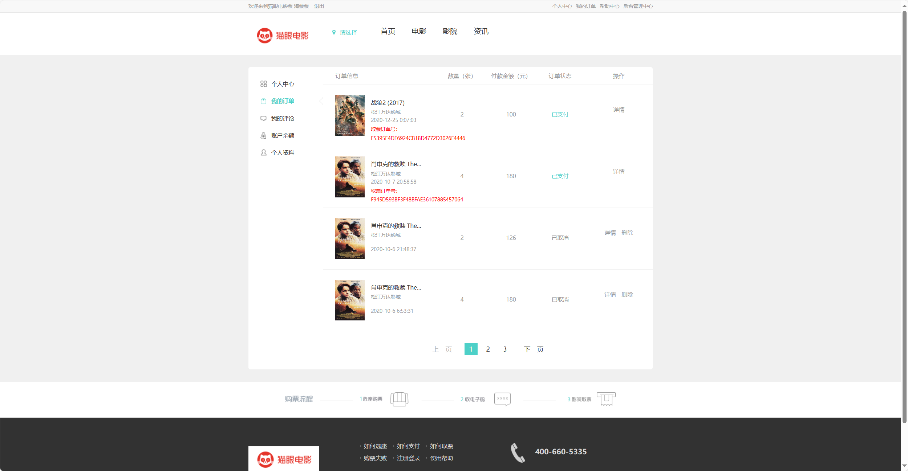
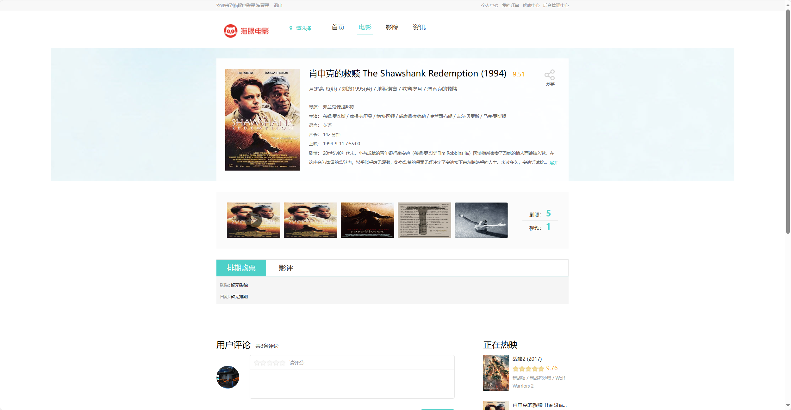
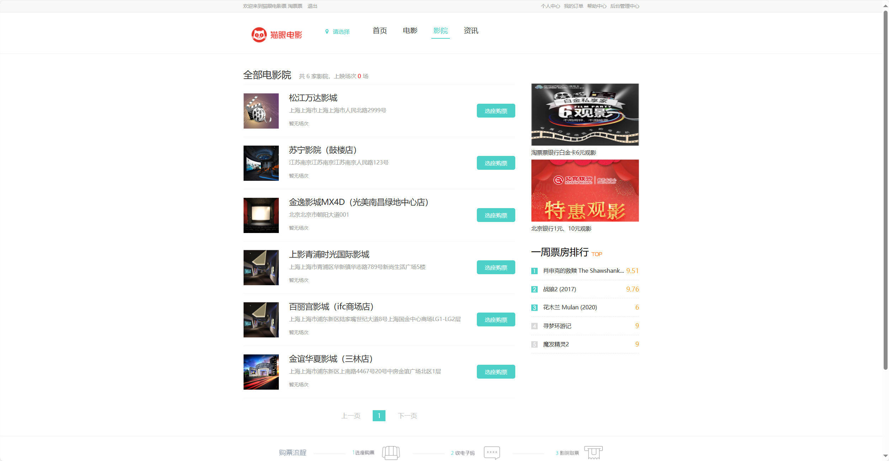
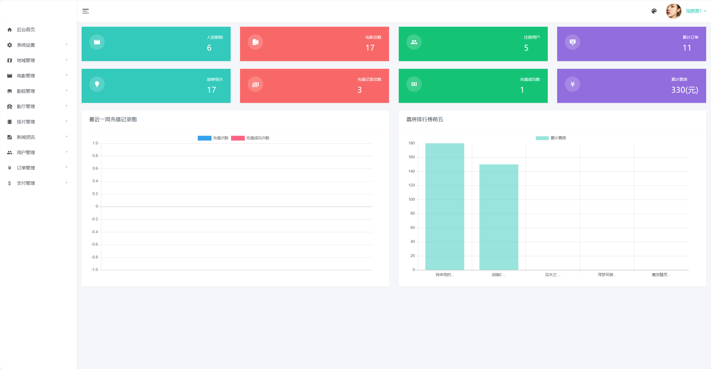
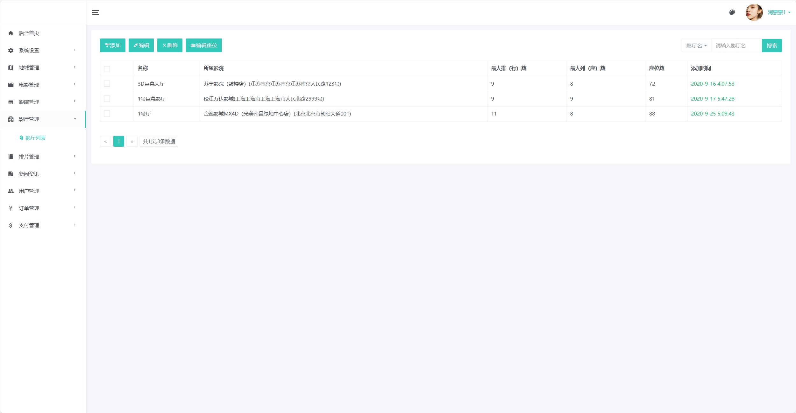

# 猫眼电影

##（源代码+12000字文档+ppt）

## 项目简介

猫眼电影是一套仿照猫眼的电影管理系统，分为前台展示与后台管理。 
观影者可在前台浏览电影详情、选座购票、电影评价等功能操作。 
管理人员可在后台对电影进行管理，包含影院管理、影厅管理、排片管理、新闻咨询等丰富功能。 
本系统后台采用Springboot+Mybatis，前端采用h5页面开发。 
涉及技术均为当前比较新进技术架构，难度适中，非常适合作为设计或学习使用。 

## 技术服务

## 技术栈

| 工具及技术             | 版本    |
| ---------------------- | ------- |
| idea                   |         |
| JDK                    | 1.8     |
| SpringBoot             | 2.2.1   |
| MyBatis                | 1.3.2   |
| JWT                    | 3.4     |
| MySQL                  | 5.7     |

## 安装教程

2.安装开发环境jdk、idea/eclipse、MySQL5.7。 
3.在mysql中创建数据库blog，导入db_boot_movie.sql。 
4.启动前端程序和后端程序即可。 
5.访问http://localhost:8080     登录首页 

## 系统图片

#### 1.电影首页
 
#### 2.电影首页
 
#### 3.我的订单
 
#### 4.电影详情
 
#### 5.影院选座
 
#### 6.后台管理
 
#### 7.后台管理
 